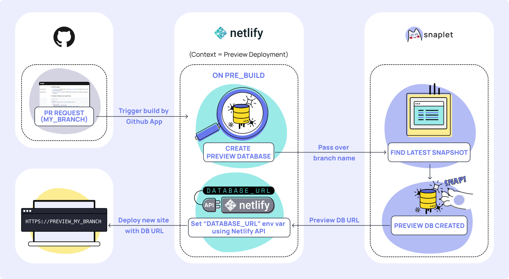

<div align="center">
  <h1 align="center">Netlify Preview Database Plugin</h1>
  <p align="center">Create an isolated preview database for each preview deployment in Netlify</p>
  
  <br /><br />
  <a href="https://docs.snaplet.dev/quickstart">Quickstart</a>
  <span>&nbsp;&nbsp;•&nbsp;&nbsp;</span>
  <a href="https://www.snaplet.dev/">Website</a>
  <span>&nbsp;&nbsp;•&nbsp;&nbsp;</span>
  <a href="https://docs.snaplet.dev/">Docs</a>
  <span>&nbsp;&nbsp;•&nbsp;&nbsp;</span>
  <a href="https://app.snaplet.dev/chat">Discord</a>
  <span>&nbsp;&nbsp;•&nbsp;&nbsp;</span>
  <a href="https://twitter.com/_snaplet">Twitter</a>
</div>
<br />

This plugin gives you a new and isolated database for your preview deployments in Netlify. When a pull-request is created, a new database is created and seeded with a Snaplet snapshot. Giving you a database (with data) to test your branch without side-effects.

## Usage

### 1. Install the plugin

- [UI Installation](https://docs.netlify.com/integrations/build-plugins/#ui-installation) (UI installation will run on all [deploy contexts](https://docs.netlify.com/site-deploys/overview/#deploy-contexts), but this plugin will only run where the context is set to `deploy-preview`).
- [File-based installation](https://docs.netlify.com/integrations/build-plugins/#ui-installation). Install the `@snaplet/netlify-plugin` npm package, by adding it as a dependency to your project.

### 2. Configure settings in your project repo

```toml
# netlify.toml

[[plugins]]
 package = "@snaplet/netlify-preview-database-plugin"
```
**Note:** We check the deploy context associated with the build. You can configure your settings by deploy context.

#### Inputs

```yaml
- name: databaseEnvVar
  required: false
  description: Database environment variable name
  default: "DATABASE_URL"

- name: databaseCreateCommand
  required: false
  description: Command used to generate the instant database
  default: "snaplet db create --git --latest"

- name: databaseUrlCommand
  required: false
  description: Command used to get the instant database url
  default: "snaplet db url --git"

- name: reset
  required: false
  description: Reset the database state on each commit
  default: false
```

### 3. Set environment variables

- In the [Dashboard](https://app.netlify.com/). Navigate to your site then `Site settings` > `Environment Variables`. Select `Specific scopes` and pick the `Build` option.

> Note: To enable deploy contexts for environment variables in the Netlify Dashboard. Navigate to `Netlify Labs` > `Scopes and Deploy Contexts for Environment Variables` and click the enable button.

- [Using build environments](https://docs.netlify.com/configure-builds/file-based-configuration/#deploy-contexts), you can define them in your project.

```toml
# netlify.toml

[[plugins]]
# ...

  [context.deploy-preview.environment]
  SNAPLET_ACCESS_TOKEN="<YOUR_SNAPLET_ACCESS_TOKEN>"
```

#### Required Environment variables

```
NETLIFY_ACCESS_TOKEN=// API Access token found in Netlify user settings.
SNAPLET_ACCESS_TOKEN=// CLI Access token found in Snaplet UI
SNAPLET_PROJECT_ID=// Project ID found in Snaplet project settings.
```

## How it works


> Netlify + Snaplet Preview Database + Snaplet Snapshots = Love.

Combining preview databases with Snaplet snapshots and Netlify preview deployments gives your team a consistent experience to evaluate your deployment's Environment Variables.

Each commit triggers a build in Netlify. Before the build starts, the plugin will create an preview database using your latest snapshot. Once the create command is done, we will inject the URL returned, into the environment variable, linked to your database (By default this variable is `DATABASE_URL`).

Once the pre-build step is executed successfully, your build will continue and a site will be deployed with the preview database.

## Additional resources

https://docs.netlify.com/integrations/build-plugins/#manage-plugin-versions
